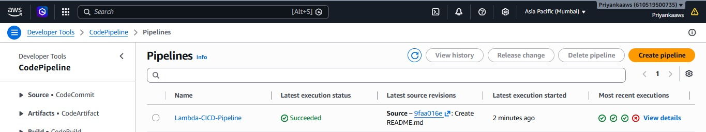
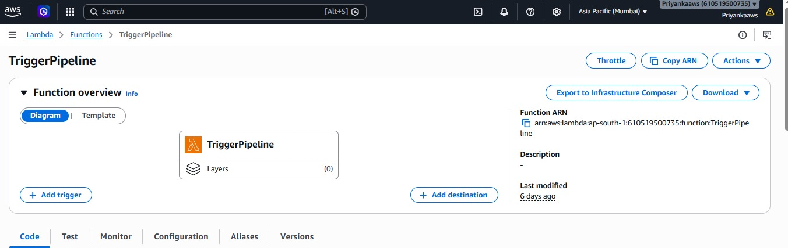
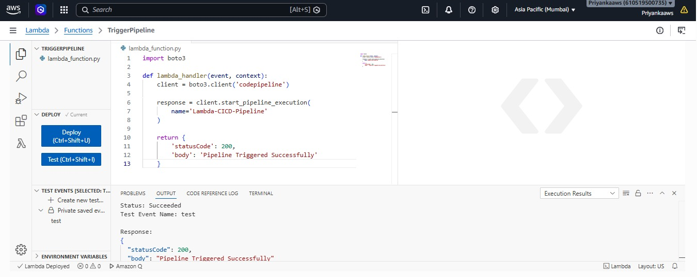
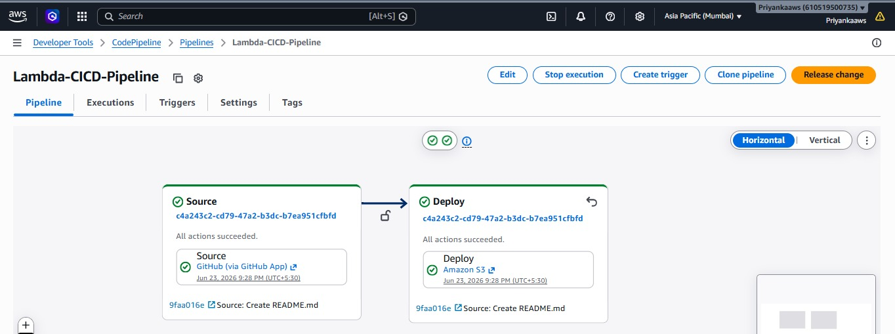

# Automate CI/CD Pipelines using AWS Lambda

## Project Overview

This project demonstrates how to automate AWS CodePipeline execution using AWS Lambda. Whenever the Lambda function is triggered, it automatically starts a CodePipeline execution, enabling automated deployment workflows.

## AWS Services Used

* AWS Lambda
* AWS CodePipeline
* Amazon S3
* IAM
* Amazon EventBridge

## Architecture

Lambda → CodePipeline → S3 Deployment

## Steps Performed

1. Created an AWS CodePipeline.
2. Configured GitHub as the source repository.
3. Created an IAM role with CodePipeline permissions.
4. Developed a Lambda function using Python.
5. Used Boto3 to start CodePipeline execution.
6. Tested Lambda function successfully.
7. Automated pipeline triggering.

## Lambda Function Code

```python
import boto3

def lambda_handler(event, context):
    client = boto3.client('codepipeline')

    response = client.start_pipeline_execution(
        name='Lambda-CICD-Pipeline'
    )

    return {
        'statusCode': 200,
        'body': 'Pipeline Triggered Successfully'
    }
```

## Project Outcome

* Automated deployment process
* Reduced manual pipeline execution
* Improved CI/CD workflow
* Hands-on experience with AWS serverless services

## Screenshots

### Pipeline Created


### Lambda Function


### Lambda Test Success


### Pipeline Execution



## Author

Priyanka Dalavi
AWS Cloud Enthusiast | Web Developer
